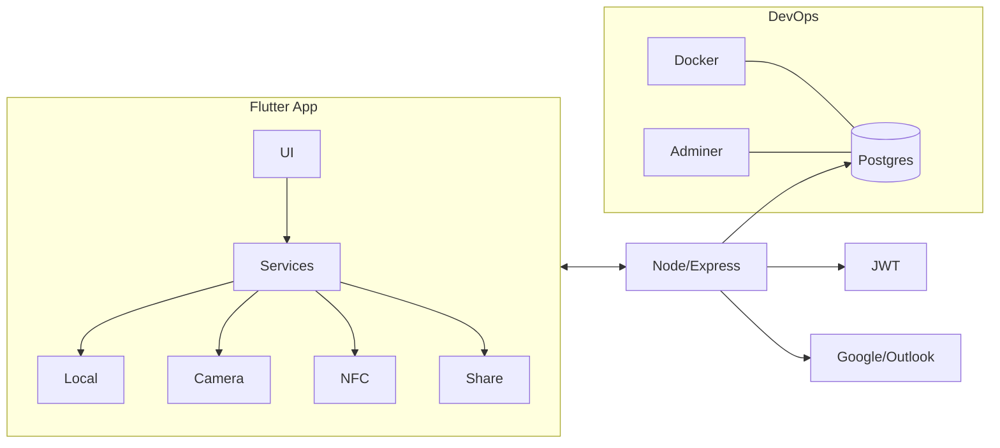

# Infinicard
## Sustainable, Smart, Enterprise-Ready Networking

October 21, 2025

---

## 🧭 Problem Statement

- Paper business cards are wasteful, static, and inefficient
- Professionals/orgs lack measurable, privacy-aware contact sharing
- Events and enterprises struggle with scalable contact management

Impact: Lost opportunities, fragmented data, poor ESG outcomes

---

## 💡 Proposed Solution

- Digital business card platform with AI, privacy, and eco metrics
- Share via QR/NFC/Links/Event modes; centralize contacts
- Measure impact (ESG-ready), analyze ROI, and scale to teams/events

Differentiators:
- ESG-ready reporting, not “eco points”
- Mass event directory + one-to-many sharing
- Enterprise analytics, roles, compliance

---

## ⚙️ System Design (Flow)

```mermaid
flowchart TD
    A[Open App] --> B{New or Returning?}
    B -- New --> C[Onboarding & Create Card]
    B -- Returning --> D[Home Dashboard]
    C --> D
    D --> E[Share (QR/NFC/Link/Event)]
    D --> F[Scan/OCR]
    D --> G[Discover]
    D --> H[Contacts]
    D --> I[Sustainability]
    D --> J[Enterprise]
```

---

## ⚙️ Architecture



---

## 🧩 Key Features

- Digital card creation + themes
- QR/NFC/Link/Event sharing with privacy policies
- Sustainability impact dashboard (ESG-ready, opt-in)
- OCR import, contacts, reminders
- Analytics & ROI, activity & notifications
- Enterprise: roles, analytics, directory
- Mass event directory & one-to-many sharing

---

## 📈 Feasibility

- Tech: Flutter, Node/Express, Postgres, Tesseract, NFC/QR → proven
- Ops: Dockerized backend, Adminer UI, simple UX
- Economic: Low initial infra; freemium/premium; enterprise-ready
- Environmental: Measurable CO₂ reduction; ESG alignment

---

## 🌱 Innovation

- ESG reporting + professional certifications
- Privacy per audience & sharing type
- Event-scale sharing + organizer workflows
- Professional gamification as credentials/benchmarking

---

## 🚀 Scalability

- Multi-platform (web/desktop planned)
- Horizontal API scale; indexed DB
- Adapters for CRM/Calendar/SSO
- i18n/L10n and multi-region hosting

---

## 🌍 Impact

- Environmental: paper saved, CO₂ avoided, trees protected
- Social: faster, accessible networking
- Economic: cost/time savings, higher conversion
- Organizational: analytics, ESG compliance

---

## 🧭 Roadmap

- Phase 1: Privacy-by-sharing, events, impact portfolio, analytics
- Phase 2: Scheduler, CRM Lite, certifications, benchmarking
- Phase 3: AI discovery, virtual events, API, SSO, white-label
- Phase 4: Marketplace, multilingual, wearables, desktop, AR cards

---

## 🔐 Privacy (Config)

- Impact metrics visibility: Off | Private | Public (Enterprise)
- Per sharing type policies: QR/NFC/Link/Event
- Role-based access, 2FA, audit trail

---

## 📦 Backend Setup (Dev)

- docker-compose up -d (Postgres @5433, Adminer @8080)
- Seeded via init-db scripts
- API: Node 18+, Express, JWT, pg

---

## 🧾 Conclusion

Sustainable, measurable, and enterprise-ready networking—
with real ROI, privacy by design, and event-scale capability.

Let’s build the future of professional connections.
