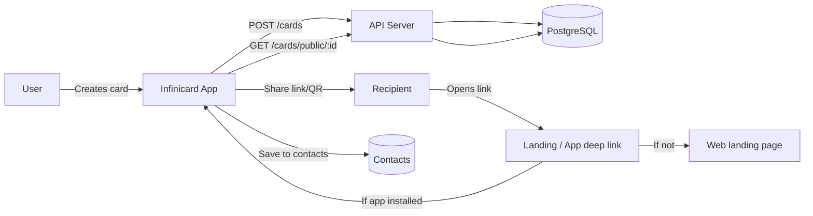
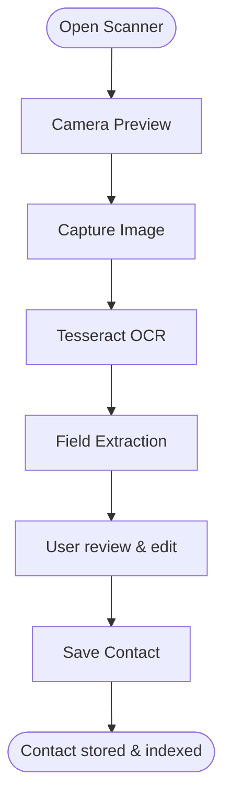

---
# Cover Page

Project Title: Infinicard — Sustainable Digital Business Cards & Networking

Team Name & Unique ID: JahnviAghera Team (UNSTOP_ID: __________)  
*Replace Unique ID with your Unstop team ID before submission.*

Institution: [Your Institution Name], [Department], [State]  
*Replace with actual institution details.*

Team Members & Contacts:
- [Full Name] — Role — email@example.com — +91-XXXXXXXXXX  
- [Full Name] — Role — email@example.com — +91-XXXXXXXXXX  
*Please fill in all team members' names and contact details before submission.*

Faculty Mentor / Guide (Optional): [Name, Email]

Date: October 24, 2025

---

## Executive Summary (160 words)

Infinicard replaces fragmented, paper-based networking with a privacy-aware, enterprise-ready digital business card platform that measures both professional outcomes and environmental impact. Users create visually rich cards on a Flutter mobile app, share them via QR, PNG/PDF, or smart web/app links, and capture physical cards using on-device OCR. The system centralizes contacts, automates follow-ups, and uses gamification to increase engagement. A minimal Node.js/Express backend with PostgreSQL provides secure storage, JWT auth, and APIs for discovery, team management, and analytics. Sustainability metrics (cards avoided, paper saved, trees preserved, CO₂ reduced) are computed using conservative assumptions embedded in the app, making the environmental benefit demonstrable and shareable. For enterprises, role-based team controls and exportable analytics enable ROI measurement for event sponsorships and outreach. The solution is deployable quickly using Docker for the backend and standard mobile distribution channels; it is designed to scale horizontally and integrate with Google/Outlook contacts and future SSO or analytics platforms.

---

## Problem Statement

Traditional physical business cards remain widely used despite digital alternatives. Exchanging paper cards is frictional: information re-entry, lost cards, and no automatic follow-up reduces conversion of initial meetings into opportunities. Environmentally, single-use printed cards generate avoidable paper waste. In this codebase we use the conservative estimate of ~2 grams of paper per card (see `lib/services/sustainability_service.dart`), and a tree equivalence of ~20,000 cards. Without tooling, professionals and enterprises lack a consistent mechanism to measure eco-savings or to centralize contacts and analytics. This creates missed professional value and preventable environmental impact at scale (for example: 10,000 shared physical cards ≈ 20 kg of paper, and using the repo assumptions ≈ 0.48 trees-worth avoided when replaced by digital sharing).

Relevance: Event organizers, sales teams, and networking professionals need lower-friction contact exchange, measurable outcomes, and enterprise controls to scale outreach while demonstrating sustainability gains.

---

## Proposed Solution

Infinicard is a mobile-first solution (Flutter) plus a lightweight backend (Node.js/Express, PostgreSQL) offering:
- Fast card creation with themed templates and live animated preview
- Multiple share channels: QR, PNG/PDF, and smart web/app links (https://infinicard.app/c/{cardId} and infinicard://share/{cardId}) with graceful landing fallback
- On-device OCR (camera + Tesseract) to import physical cards into structured contacts with a quick review/edit step
- Discovery service (location/field filters), connection requests, and activity logs
- Gamification: points, badges, and leaderboards to drive adoption
- Sustainability dashboard that quantifies cards avoided, paper saved, trees protected, and CO₂ reduced

Technologies: Flutter (mobile UI), Node.js/Express (API), PostgreSQL (data), Docker Compose (local dev), Tesseract OCR (on-device extraction), SharedPreferences (local cache), JWT (auth). For scale: Redis (cache), background workers (BullMQ/Redis), and CDN for assets.

How it solves the problem:
- Reduces friction by automating data capture and offering ubiquitous share links
- Increases conversion with fast save/import and follow-up reminders
- Makes environmental benefits tangible and shareable to motivate behavior change

---

## Objectives and Expected Outcomes

- Measurable goals (6 months):
  - 10,000 card shares through the app or links
  - 25% of received cards saved as structured contacts within the app
  - Demonstrable reduction of paper use equivalent to at least 5 trees (calculated with repo assumptions)
  - Enterprise adoption: 3 pilot teams (10–50 users each)
- Product outcomes:
  - Lowered friction in contact capture (OCR-assisted saves)
  - Clear sustainability metrics per-user and aggregated for teams
  - Actionable analytics for event ROI and team performance

---

## Implementation Plan / Methodology

Phases and major milestones:

- Phase 0 — Setup (1 week): Repo review, Docker backend up (Postgres + Adminer), flutter pub get, configure base URLs
- Phase 1 — MVP (3–4 weeks): Auth (JWT), Card CRUD, public card endpoint, share link generation, client share UI, OCR capture + edit flow, sustainability dashboard calculation
- Phase 2 — Growth (4–6 weeks): Discover APIs, connections, notifications, contacts import/export, Google/Outlook integration, initial enterprise/team features
- Phase 3 — Scale (6–8 weeks): Caching (Redis), background processing, analytics dashboards, SSO/provisioning, deployment pipelines, observability and backups

Flow — Create → Share → Save (mermaid):

Flow — OCR import:

Data & validation: OCR output is pre-validated with regex checks (emails/phones) and presented to the user for quick correction before save.

---

## Feasibility & Scalability

Resources required (initial MVP):
- Human: 2–3 full-stack developers (Flutter + Node), 1 UX/PM, 1 QA — 6–10 person-weeks
- Financial: cloud hosting (small DB instance + object storage) ~$50–200/month for early stage; additional costs for analytics and CDN as usage grows
- Technical: environment for CI/CD, Docker hosting, domain (infinicard.app) with SSL, and app-store distribution accounts

Scalability plan:
- Stateless API pods behind load balancer; PostgreSQL with read replicas and partitioning for activity logs
- Redis for caching hot items (profiles, public cards) and rate-limiting
- Background workers for heavy tasks (link analytics, email) using Redis/Bull
- CDN for landing assets and images; use autoscaling groups for API

Replication potential: The architecture is cloud-agnostic and can be replicated across regions (multi-AZ DB, multi-region CDN) for global events and enterprise deployments.

---

## Impact Assessment (Quantified Examples)

Using repo assumptions (2 g per card; 20,000 cards ≈ 1 tree):
- If 1,000 users each share 10 cards in a month: 10,000 cards avoided → 20 kg paper saved → ≈ 0.5 trees-worth saved
- If 10,000 shared cards are replaced by digital sharing: 20 kg of paper avoided → ~1 tree-worth saved (repo uses 20,000 cards per tree, calculations here are illustrative and conservative)

Social & economic impact:
- Faster follow-ups and structured contacts increase conversion potential for sales/recruiting teams
- Enterprises can report ESG improvements and reduced material spend on printed collateral

Environmental: Sustainability dashboard makes benefits trackable, shareable, and usable in CSR reporting.

---

## Challenges and Mitigation Strategies

- OCR accuracy and edge cases — Mitigation: present editable parsed form, include common heuristics (name/email/phone patterns), allow manual entry fallback and confidence UI
- Deep/app link verification across platforms — Mitigation: follow `WEB_LINK_SHARING_GUIDE.md` (apple-app-site-association & assetlinks.json), robust landing page fallback
- Privacy & compliance (GDPR) — Mitigation: implement export/delete endpoints, per-card privacy levels, and clear consent flows for sharing
- Adoption friction — Mitigation: gamification, easy share templates, enterprise onboarding and incentives for events
- Backend scale/cost — Mitigation: caching, rate limits, and staged feature rollout; instrument to monitor cost vs. value

---

## Conclusion

Infinicard delivers a practical, deployable, and measurable alternative to physical business cards, combining low-friction sharing, OCR-assisted contact capture, and enterprise-grade analytics with a sustainability-first narrative. Technology choices (Flutter, Node.js, PostgreSQL, Tesseract) enable rapid iteration and easy scaling. The product's blend of behavioral incentives (gamification) and hard metrics (paper/CO₂ saved) creates both immediate user value and organizational reporting value — making the idea unique, feasible, and impactful for individuals, events, and enterprises.

---

## References (APA style)

- Infinicard Project Documentation. (2025). `PROJECT_OVERVIEW.md`, `FEATURES.md`, `WEB_LINK_SHARING_GUIDE.md`, repository: JahnviAghera/infinicard.  
- Infinicard source code. (2025). `lib/services/sustainability_service.dart` — sustainability calculations (2 g per card assumption).  
- Flutter. (2025). Flutter documentation. https://flutter.dev/docs  
- PostgreSQL Global Development Group. (2025). PostgreSQL Documentation. https://www.postgresql.org/docs/  
- Tesseract OCR. (2025). Tesseract OCR Documentation. https://github.com/tesseract-ocr/tesseract  
- Docker. (2025). Docker Compose documentation. https://docs.docker.com/compose/

---

Notes:
- Fill in the cover page placeholders (team ID, institution, team member contact details) before final submission to Unstop.
- If you want, I can: export this to a PDF, generate a 10-slide pitch deck, or tailor the content to specific Unstop form fields.

