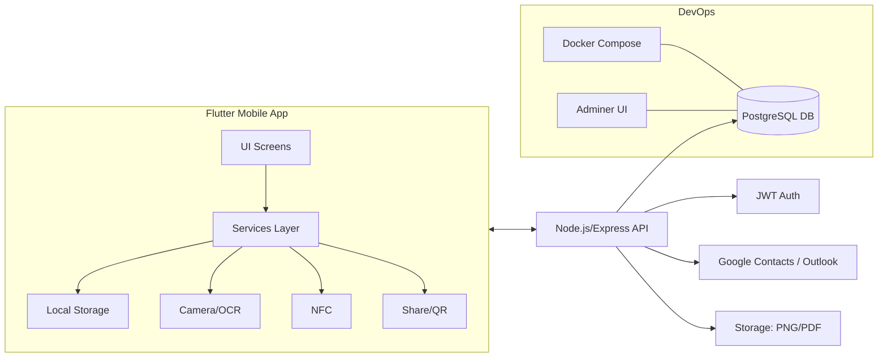

# Infinicard – Complete Concept & Solution Document

Date: October 21, 2025

---

## 🧭 1. Problem Statement Recap

Traditional business cards are wasteful, static, and hard to manage at scale. Professionals and organizations lack a sustainable, measurable, and intelligent way to share, control, and analyze contact exchanges—especially at events and in enterprise settings—leading to lost opportunities, fragmented data, and environmental waste.

Why it matters: Affects professionals, recruiters, sales teams, event organizers, and enterprises aiming for ESG/CSR goals and better networking ROI.

---

## 💡 2. Proposed Solution (Concept)

Infinicard is a professional digital business card and networking platform that replaces paper cards with privacy-aware, AI-enhanced, and eco-focused digital identities. Users create rich digital cards, share via QR/NFC/links, manage contacts centrally, analyze outcomes, and demonstrate measurable environmental impact.

What’s different:
- ESG-ready impact metrics with business framing (paper saved, CO₂ avoided, trees protected) for ROI, compliance, and reporting
- Professional-grade privacy control per audience and per sharing type
- Mass event directory + one-to-many contact sharing
- Enterprise-ready analytics, roles, and integrations

Optional artifacts: Wireframes and diagrams are referenced below; visuals can be refined in Figma.

---

## ⚙️ 3. System / Solution Design

### 3.1 User Flow (Mermaid)

```mermaid
flowchart TD
    A[Open App] --> B{New or Returning?}
    B -- New --> C[Onboarding & Create Card]
    B -- Returning --> D[Home Dashboard]
    C --> D
    D --> E[Share Card (QR/NFC/Link/Event)]
    D --> F[Scan/OCR Physical Card]
    D --> G[Discover Professionals]
    D --> H[Contacts & Follow-ups]
    D --> I[Sustainability Dashboard]
    D --> J[Enterprise/Team Analytics]
    E --> K{Sharing Type}
    K -- QR --> L[Public/Basic View]
    K -- NFC --> M[Medium Info View]
    K -- Link --> N[Custom Link Policy]
    K -- Event --> O[Event Directory Listing]
    O --> P[Mass Contact Sync]
    F --> H
    H --> Q[Activity Log & Notifications]
    I --> R[Impact Reports & Certificates]
```

### 3.2 High-Level Architecture (Mermaid)



### 3.3 Modules Overview
- Mobile App (Flutter): Cards, Contacts, Discover, Rewards, Sustainability, Integrations, Enterprise, Notifications, Activity, OCR Scan, Settings
- Backend API (Node/Express): Auth, Cards, Contacts, Discover, Activity, Notifications, Sync
- Database (PostgreSQL): Users, Business Cards, Contacts, Tags, Professionals, Logs
- Integrations: Google Contacts, Microsoft Outlook, CSV/vCard

### 3.4 Technical Stack
- Frontend: Flutter 3.x, Material 3, Dart 3.8, Packages (camera, tesseract_ocr, share_plus, qr_flutter, nfc_manager, url_launcher, permission_handler)
- Backend: Node.js 18+, Express, JWT, pg (PostgreSQL), Docker Compose, Adminer
- Infra: Docker (postgres, adminer), local dev on Windows/macOS/Linux
- Security: JWT Auth, 2FA (app-level), role-based access, privacy tiers

---

## 🧩 4. Key Features / Modules

- Digital Card Creation & Themes: Create professional cards with 8+ themes, live preview
- QR / NFC / Link / Event Sharing: Multiple channels with privacy-aware views
- Sustainability Impact Dashboard: Real-time metrics for paper/CO₂/trees, shareable
- OCR-Based Contact Import: Camera capture with Tesseract OCR and editable fields
- Contacts & Follow-ups: Notes, reminders, quick actions, duplicate detection
- Discover & Recommendations: Location/field filters and AI-style suggestions
- Analytics & ROI: Card views/scans, engagement CTR, conversion, cost savings
- Privacy & Access Control: Multi-tier visibility and sharing-type policies
- Impact Metrics Visibility: Toggle visibility of sustainability metrics (Off | Private | Public for Enterprise), plus per-sharing-type policies (QR/NFC/Link/Event)
- Enterprise & Teams: Roles, analytics, member directory, growth metrics
- Integrations & Sync: Google Contacts, Outlook, CSV import/export
- Notifications & Activity Log: Timeline and actionable notifications
- Mass Event Directory & Sharing: Event attendee directory and one-to-many sharing

Screenshots/mockups: Refer to `FEATURES.md` and app for implemented UI.

---

## 📈 5. Feasibility

- Technical: Uses proven stacks—Flutter, Node, PostgreSQL, Tesseract OCR, NFC/QR standards
- Operational: Simple onboarding, clear UX, Adminer for DB management, Dockerized backend
- Economic: Low infra footprint initially; scales horizontally; freemium/premium viable
- Environmental: Eliminates paper cards; measurable CO₂ reduction; supports ESG/CSR

---

## 🌱 6. Innovation

- Sustainability as a first-class metric with professional reporting/certification
- Privacy per audience and per sharing type (QR vs NFC vs Link vs Event)
- Mass event directory and bulk sharing with follow-ups (organizer-friendly)
- Professional gamification reframed as certifications, benchmarking, ROI

---

## 🚀 7. Scalability

- App: Flutter scales across platforms (Android/iOS, web/desktop planned)
- Backend: Stateless API, horizontal scaling, indexed Postgres, caching-ready
- Data: Partitioning and archiving strategies; background jobs for OCR/analytics
- Integrations: Modular adapters for CRM, calendar, SSO, marketing tools
- Globalization: i18n/L10n, multi-region hosting, GDPR-ready

---

## 🌍 8. Impact

- Environmental: Paper saved (2g/card), trees protected (20,000 cards/tree), CO₂ reduced (1kg/1,000g)
- Social: Better, faster professional networking; accessibility via digital mediums
- Economic: Saves print/design/shipping cost; improves lead conversion and time-to-contact
- Organizational: Analytics for teams; ESG reporting; enterprise policy compliance

---

## 🧭 9. Future Roadmap

- Phase 1 – MVP/Foundation: Privacy tiers per sharing type, event directory + mass sharing, impact portfolio/ROI, baseline analytics
- Phase 2 – Growth: Scheduler, CRM Lite, certifications, benchmarking, dynamic QR, bulk OCR
- Phase 3 – Scale/Enterprise: AI recommendations, virtual events, API access, SSO, white-label
- Phase 4 – Premium/Global: Marketplace, multilingual, wearables, desktop app, AR cards

Reference: `NEW_FEATURES_ROADMAP.md` for detailed backlog and phases.

---

## 🧾 10. Conclusion

Infinicard is sustainable, technically feasible, and oriented toward tangible professional outcomes. By combining eco-impact, privacy-aware sharing, analytics, and event-scale networking, it delivers measurable value to individuals and enterprises while reducing environmental waste.

---

## 📎 Appendices (Optional for Unstop)

- UI mockups / wireframes (Figma link placeholder)
- Data flow diagrams (add via draw.io/mermaid when needed)
- API structure: See `backend/API_DOCUMENTATION.md`
- Environmental metrics formula
  - Paper per card = 2g
  - Trees saved = cards_saved / 20,000
  - CO₂ reduced = paper_grams / 1,000

---

## ✅ In Short — Deliverables Checklist

| # | Deliverable | Required | Status/Notes |
|---|-------------|----------|--------------|
| 1 | Problem statement (summary) | ✅ | Included in section 1 |
| 2 | Proposed solution | ✅ | Section 2 |
| 3 | Flowcharts / diagrams | ✅ | Mermaid diagrams (flow + architecture) |
| 4 | System architecture | ✅ | Section 3.2 |
| 5 | Key features | ✅ | Section 4 |
| 6 | Feasibility | ✅ | Section 5 |
| 7 | Innovation | ✅ | Section 6 |
| 8 | Scalability | ✅ | Section 7 |
| 9 | Impact | ✅ | Section 8 |
|10 | Roadmap / next steps | ✅ | Section 9 |
|11 | References / visuals | Optional | Linked files/diagrams |
|12 | Final PDF / Presentation | ✅ | See export instructions below |

---

## 🖨️ Export to PDF / Presentation (Unstop)

Option A – Markdown → PDF (VS Code):
1. Install extension: "Markdown PDF" (yzane)
2. Open `UNSTOP_SUBMISSION_DRAFT.md`
3. Right-click → "Markdown PDF: Export (pdf)"

Option B – Slides from Markdown (Marp):
1. Install extension: "Marp for VS Code"
2. Use the provided `UNSTOP_PITCH_DECK.md` (optional) or convert this doc
3. Command Palette → Marp: Export slide deck (PDF)

Option C – Copy to Google Docs / PowerPoint:
- Paste content; keep diagrams as images or export Mermaid via mermaid.live

Notes (Windows cmd):
- For CLI exports, prefer VS Code UI on Windows. If using Node tools, use PowerShell.
